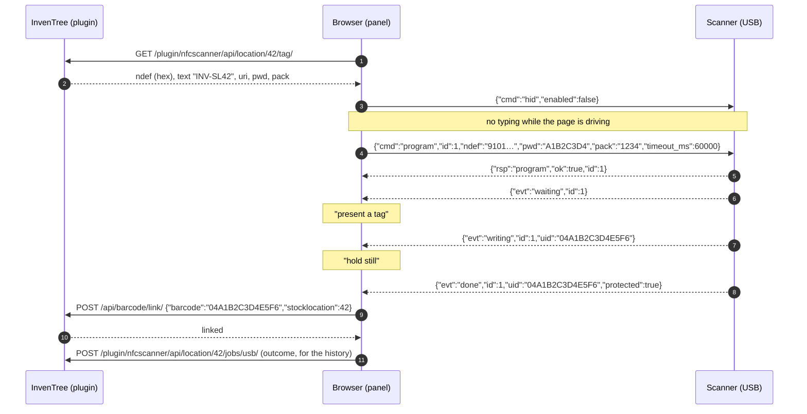
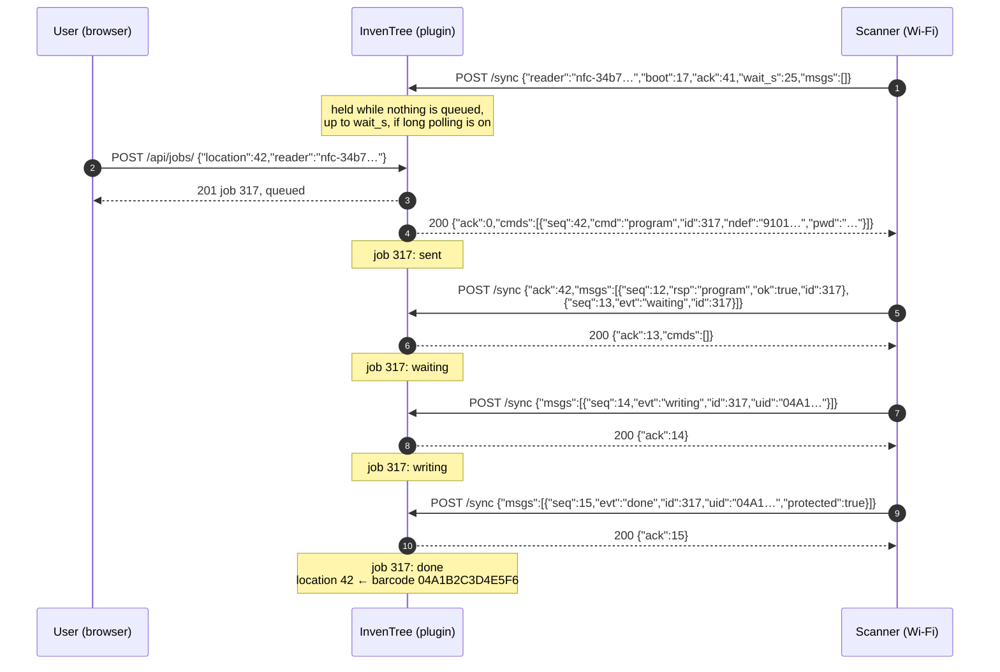
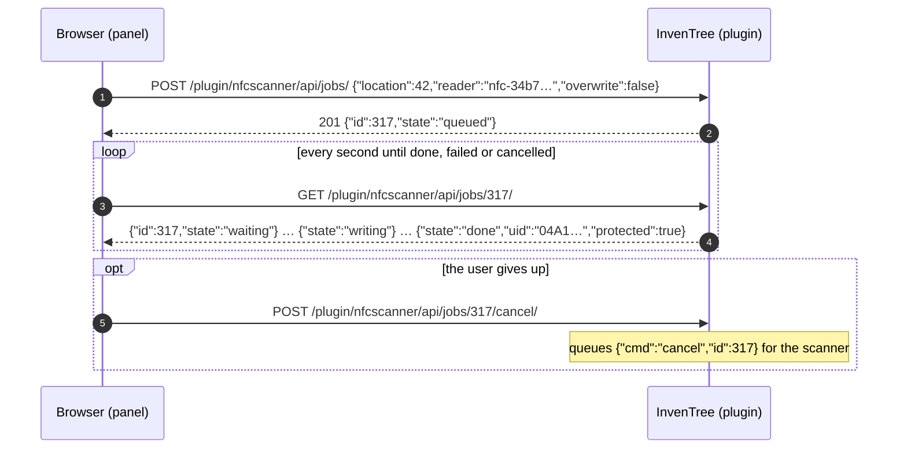
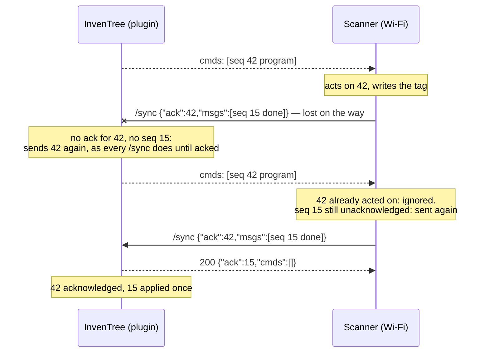

# InvenTree plugin: plan

Status: implemented through phase P2 on 2026-10-05, in `inventree-nfc-scanner-plugin` next
to this repository; see its README and docs/api.md for what was built. Deviations from this
plan are noted there. The sections below are the plan as it was. It is the counterpart of
[network-transport-plan.md](network-transport-plan.md), which has the reader's side of the
`/sync` exchange; this document has the plugin's side and everything the browser does.

## What it does

One plugin, `inventree-nfc-scanner`, lets a user program the NFC tag on a storage bin from
the stock location's page, by either of two routes:

- **USB.** The scanner is plugged into the user's computer and the browser drives it over
  WebSerial. The browser does the work and the server only supplies the data.
- **Network.** The scanner is on Wi-Fi, polling the plugin for jobs. The server does the
  work and the browser watches. This is the route when there is no USB connection, or the
  browser has no WebSerial (Firefox, Safari, phones), or the scanner is a headless unit in a
  tower.

The user sees one button, "Program tag", and the plugin picks the route: USB if the browser
can do WebSerial and the user connects a scanner, otherwise a network scanner of their
choosing. Looking a tag up needs no plugin at all: the desk scanner types the location's
barcode into InvenTree's scan dialog as a keyboard.

What a tag holds, and how the scanner is driven over USB, is settled and unchanged: see the
firmware's [README](../README.md) for the protocol, and `tools/webserial.html` for a working
browser client of it, which the panel grows out of.

## InvenTree interfaces used

The target is the installation it is for: **InvenTree 1.4.3** (July 2026), Django 5.2,
PostgreSQL, in Docker on a Raspberry Pi. The plugin is a standard InvenTree plugin package,
made from the `inventree-plugin-creator` template, with its browser side built with Vite
against `@inventreedb/ui`. Method and field names below are as I know them from the 1.x
line; 1.4.3 is newer than that, so the first task of P0 is to check each against its
documentation and the plugins already running there (`inventree-machines` and
`inventree-label-machine` are good examples of the machine framework in use).

Four of InvenTree's global plugin settings have to be on for this plugin: URL integration,
app integration, interface integration, and events. In Docker the package goes into the
instance's `plugins.txt` so it survives an image update.

| Interface | Used for |
| --- | --- |
| `SettingsMixin` | Site-wide settings (the tag password, timeouts, long polling) and per-user settings (default scanner) |
| `UrlsMixin` | The plugin's own HTTP endpoints under `/plugin/nfcscanner/`: `/sync` for scanners, and a small API for the browser |
| `AppMixin` | A Django app with models: jobs, and the message bookkeeping behind `/sync` |
| `UserInterfaceMixin` | `get_ui_panels()`: the "NFC tag" panel on a stock location's page. `get_ui_dashboard_items()`: scanner status on the dashboard |
| **Machine framework** (`MachineType`, `BaseDriver`) | Each network scanner is a *machine* of a new "NFC scanner" type. InvenTree then provides the list of scanners, their settings, their status and the admin pages for them; the plugin provides the type and one driver, "network", whose instances are matched to `/sync` callers by `reader_id` |
| `EventMixin` (later) | Raising an InvenTree event when a network scanner reports a tap, for automation such as a tower |
| `LabelPrintingMixin` (later) | Appearing as a "printer" so a stack of bins can be programmed one after another from InvenTree's label-printing flow; with the machine framework this is the same shape as `inventree-label-machine` |

The machine framework replaces the `Scanner` model the first draft of this plan had: a
machine already has a name, a driver, per-instance settings (the `reader_id`, the token's
user, an optional location), a status that shows in the Machines admin page, and
registration from the UI rather than the Django admin.

Not used: `BarcodeMixin`. Linking a tag's UID to its location uses InvenTree's own barcode
support (`/api/barcode/link/` from the browser; `assign_barcode()` on the model from the
server), and InvenTree's internal barcode plugin already resolves `INV-SL<pk>`.

## How the plugin talks to scanners

There are two kinds of conversation, and the plugin never mixes them up: the browser talks
to a USB scanner directly, and the server talks to network scanners. The messages are the
same JSON objects in both; only the carrier differs.

### USB: the browser and the scanner

The panel's JavaScript opens the scanner with WebSerial (`navigator.serial.requestPort`
filtered to USB `303a:4E46`, `baudRate` 115200, DTR raised) and speaks the scanner's
protocol, one JSON object a line. The server is involved exactly twice.

- `failed` with `not_blank` carries what the tag already holds; the panel shows it and
  offers to overwrite, which repeats the job with `"overwrite":true`.
- The panel keeps the port open while it is visible, so a tag placed on the scanner is
  reported (`tag` events) and shown: "this tag holds INV-SL7, protected".
- Closing the port ends the session, and the scanner's keyboard output returns to its stored
  setting.

### Network: the server and the scanner

The scanner calls `POST /plugin/nfcscanner/sync/` with an InvenTree API token, carrying what
has happened and collecting commands; the full contract, with numbering, acknowledgements
and long polling, is in the network transport plan. The plugin's side of it:

- A job's `id` on the wire is the job's primary key, so every message about it finds its row.
- `waiting`, `writing`, `done` and `failed` move the job's state; `done` links the UID to the
  location on the server, with no browser involved.
- A `tag` event that is not part of a job is stored as the scanner's last tap, shown in the
  dashboard item, and (later) raised as an event.
- Every message is numbered. A command is sent again on every `/sync` until the scanner's
  `ack` covers it; a message the scanner sends again is recognised by `(reader, boot, seq)`
  and not applied twice. A `boot` value the server has not seen resets its expectations.
- A scanner is "online" when its last `/sync` is recent; this is reported as the machine's
  status, so it shows wherever InvenTree shows machines.
- A `/sync` from a `reader_id` that matches no machine is answered 404 and logged; the
  scanner keeps trying slowly, and appears once someone creates its machine.

### Network: the browser watching a job

The panel shows the same stages as over USB: queued (not yet collected by the scanner),
waiting (present a tag), writing (hold still), done, failed with the reason. Cancel is
`POST .../jobs/317/cancel/`, which queues a `cancel` command for the scanner.

### Nothing lost, nothing twice

What the numbering in `/sync` buys, in one picture:

## The port, the keyboard, and more than one tab

The firmware's rule for keyboard output does most of the work: `hid` without `persist`
lasts only while the port is open, so closing the tab or navigating away returns the scanner
to its stored setting by itself. The panel never persists anything. While it holds the port
it does better than typing: a `tag` event opens the location's page directly, no focused
input needed. The desk scanner is a navigator while an InvenTree tab is connected and a
keyboard the rest of the time.

- **Reconnecting needs no click.** Once the user has granted the port,
  `navigator.serial.getPorts()` returns it on later loads, and the panel opens it silently.
- **The port is held only while the tab is visible** (`visibilitychange`). A tab left open
  in the background would otherwise keep typing off for every other application all day.
- **One tab at a time.** The browser allows one open handle per port, so tabs coordinate
  with the Web Locks API: the tab holding the `nfc-scanner` lock holds the port, and
  releases both when hidden, so switching tabs hands the scanner over. Two visible windows
  is the one case needing a choice: the second shows "in use by another window" and a
  take-over button, which steals the lock; the holder closes its port on losing it.
- **A USB job belongs to the tab holding the port.** The panel warns before unload while a
  job is waiting or writing. For the case that slips through, `info` will report `last_job`
  (id, outcome, UID), a small firmware addition, so a tab that reconnects after an
  accidental navigation mid-write still finds the result and links the UID.
- **Network jobs need no coordination.** The server is the single source of truth: any tab
  can watch any job, and the server sends a scanner one job at a time, queueing the rest;
  the panel shows the queue position. A tap on a network scanner is a server-side fact that
  a tab acts on only if it has chosen to follow that scanner, a kiosk feature for later.
- **Keyboard typing** goes to whichever window has focus, as any keyboard's does.

## One NDEF builder

What goes on a tag is built in one place: on the server, in Python. The USB route fetches
it (`/api/location/<pk>/tag/`); the network route puts it in the command. `tools/nfcprog.py`
in the firmware repository has the reference implementation and the firmware's host tests
check its output, so the plugin's builder is tested by comparing bytes with it. The URI
record uses InvenTree's configured base URL.

## Data model

| Model | Fields | |
| --- | --- | --- |
| machine (InvenTree's) | name, driver "network", settings: `reader_id` (from the MAC), `user` (whose token it calls with), `location` (optional, where it sits) | One per network scanner, made in the Machines admin page. Its status, last seen and last tap are the machine's status fields |
| `Job` | `location`, `machine` (null for USB jobs), `created_by`, `created_at`, `state` (queued, sent, waiting, writing, done, failed, cancelled), `overwrite`, `uid`, `error`, `error_detail`, `finished_at` | USB jobs are recorded too, by the panel reporting their outcome, so the history is complete |
| `ScannerCommand` | `machine`, `seq`, `job`, `payload`, `sent_at`, `acked_at` | What `/sync` hands out until acknowledged |
| `ScannerMessage` | `machine`, `boot`, `seq`, `received_at` | Only to recognise a repeat; the content is applied, not kept |

## Endpoints

All under `/plugin/nfcscanner/`. The browser ones use InvenTree's session, the scanner one
a token.

| Method, path | Who | Does |
| --- | --- | --- |
| `POST sync/` | scanner, token | The exchange above |
| `GET api/location/<pk>/tag/` | browser | The message for the location's tag, with the password and PACK |
| `POST api/location/<pk>/jobs/usb/` | browser | Records the outcome of a USB job (for the history; optional) |
| `GET api/scanners/` | browser | Scanners, with online state and last tap |
| `POST api/jobs/`, `GET api/jobs/<id>/`, `POST api/jobs/<id>/cancel/` | browser | Network jobs |

Permissions: a browser user needs change permission on stock locations to program a tag.
A scanner's token must belong to the user named in its machine's settings, and that user
needs nothing beyond the plugin's own `sync` permission (declared on the `Job` model's
app): it cannot change stock itself.

## Settings

| Setting | Default | |
| --- | --- | --- |
| `TAG_PASSWORD` | blank: no protection | Four bytes as hex, the same for every tag; protected |
| `TAG_PACK` | `0000` | |
| `JOB_TIMEOUT_S` | 60 | How long a scanner waits for a tag |
| `LONG_POLL` | off | Whether `/sync` may hold a request |
| `LONG_POLL_MAX_S` | 25 | Longest hold, under the proxy's limit |
| `SCANNER_OFFLINE_S` | 40 | After this long without a `/sync`, a scanner is shown offline |
| per user: `DEFAULT_SCANNER` | | The network scanner the panel offers first |

Long polling holds a server worker per scanner for the duration. It is off by default;
the scanner falls back to a poll a second by itself, so nothing breaks either way. On the
Raspberry Pi installation the number of gunicorn workers is small, so leave it off there
unless there is one scanner and the workers have been counted.

## Tools for developing it without the firmware's network build

The firmware's network side does not exist yet, and the plugin comes first. Two small
scripts in the firmware repository's `tools/` make the plugin testable now:

- **`tools/sync_bridge.py`**: connects a desk scanner over USB and speaks `/sync` to the
  plugin on its behalf, exactly as the firmware will. With it, the real scanner on the desk
  is a "network scanner" to the plugin, and the whole network route can be exercised with
  real tags before any radio code exists.
- **`tools/fake_reader.py`**: the same without hardware, over the host simulator, for the
  plugin's automated tests: it writes to a simulated tag and reports back.

`tools/fake_plugin.py` is the mirror image, for the firmware's tests, and the two must agree;
the `/sync` contract in the network transport plan is the thing they agree on.

## Phases

| # | Scope | Exit test |
| --- | --- | --- |
| P0 | Check every interface name against 1.4.3. Package skeleton, settings, the machine type and driver, models, `/sync` with token auth and the numbering, `sync_bridge.py` and `fake_reader.py` | A machine made in the Machines page goes online when `fake_reader.py` calls with its `reader_id`; a command queued for it reaches it once, is acknowledged, and a repeated message is not applied twice; Django tests for the exchange |
| P1 | The panel on the stock location page, USB route: tag data endpoint, WebSerial client with silent reconnect, visibility and tab coordination, tap-to-navigate, job stages, overwrite flow, UID link | On an InvenTree dev instance with the desk scanner: program a bin from its page; the location's barcode shows the UID; a second attempt offers to overwrite |
| P2 | Network route: jobs API, scanner chooser in the panel, progress polling, cancel; `done` links the UID on the server | The same bin programmed through `sync_bridge.py` from a browser without WebSerial (Firefox); cancel works; a scanner going offline mid-job is reported |
| P3 | Long polling, the dashboard item with each scanner's status and last tap, `EventMixin` events for taps | With `LONG_POLL` on, a job reaches the scanner within a second of being queued; off, within two |
| P4 | Against the real network firmware (its phase N2 onward); OTA command from the admin (firmware N4) | A headless scanner on Wi-Fi programs a tag from the browser with no USB anywhere |
| P5 | Optional: `LabelPrintingMixin` for programming a stack of bins in sequence | Select ten locations, "print" to a scanner, tap ten tags |

## Risks

- **1.4.3 is newer than what I know.** The names above are from the 1.x line as of early
  2026; the machine framework and the UI plugin API have both moved since 0.17. P0 starts
  by checking each against the 1.4.3 documentation and source, and the plan is corrected
  before anything is built on it.
- **Secrets reach the browser on the USB route.** The tag password is served to the page,
  because the page is what writes the tag. It is a tamper deterrent, not a secret worth
  more than that, and it crosses the air in the clear on every write anyway.
- **Long polling and workers.** Covered above; off by default.
- **Two implementations of `/sync`'s client.** `sync_bridge.py` and later the firmware. The
  contract document and `fake_plugin.py` are what keep them the same.

## To decide

Settled: the target is InvenTree 1.4.3, the installation on `inventree.example`.

1. **A token per scanner or one shared "scanners" user?** Assumed one user per scanner,
   so a lost unit can be revoked alone.
2. **Should USB jobs be recorded on the server?** Assumed yes, for one history of who
   programmed which bin when; it is one extra request from the panel.
3. **Where does the plugin live?** Assumed its own repository and PyPI package; the
   `/sync` contract and the two bridge scripts stay in the firmware repository.
